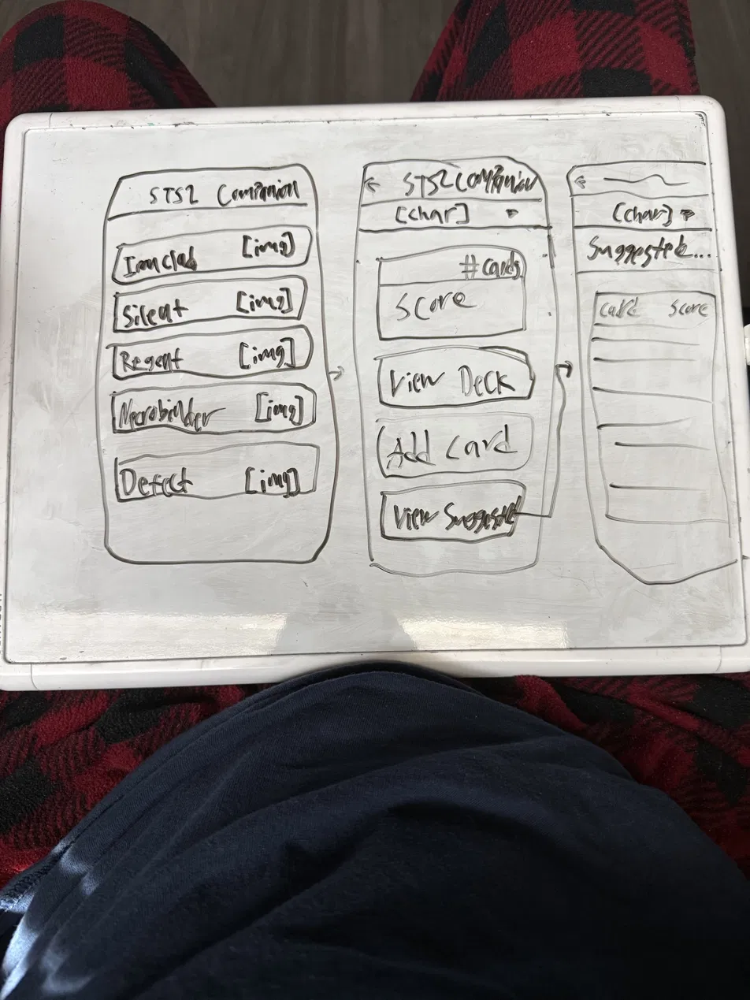
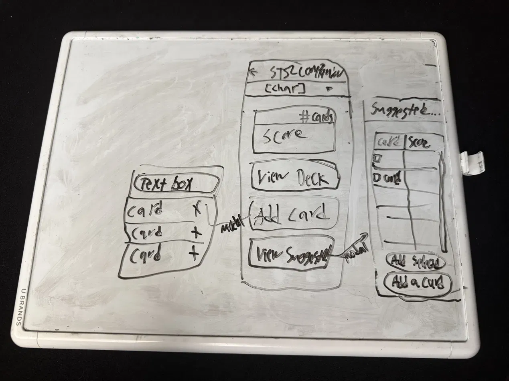
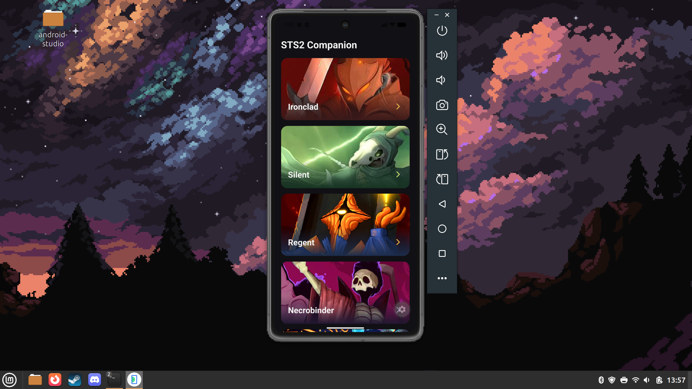
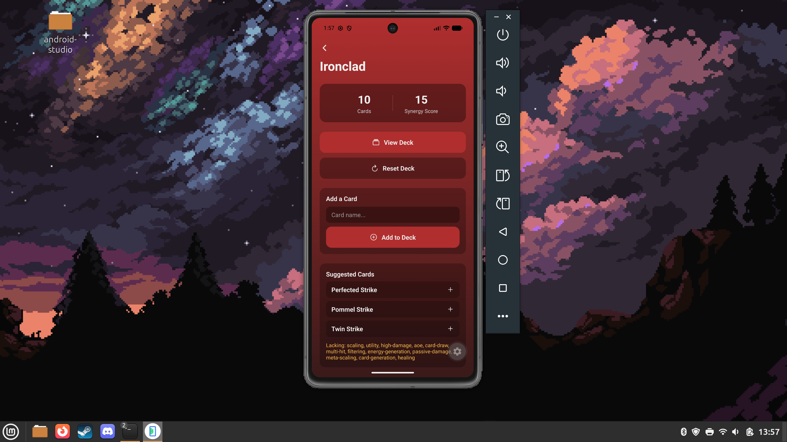
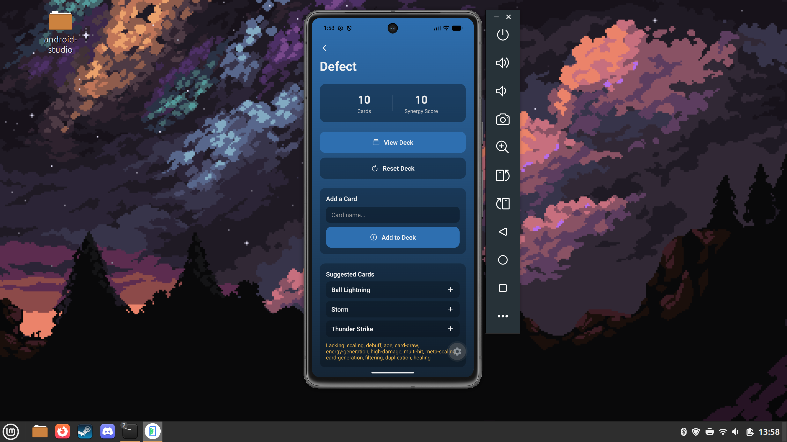
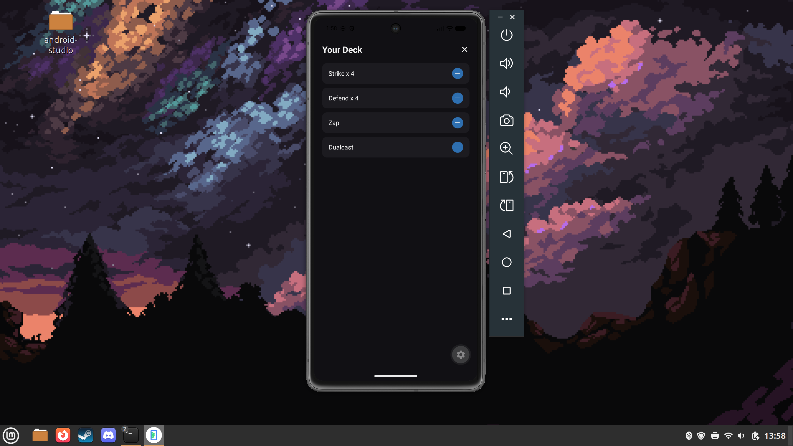

## Wireframes




## Screenshots






## About

A Slay the Spire 2 deck-building companion app. Pick a character, build out your current run's deck, and get suggested cards that synergize with what you've already picked up.

## Screens

- **Character Select** — list of characters (Ironclad, Silent, Regent, Necrobinder, Defect); tapping one opens their deck screen
- **Deck** — shows current deck's card count and synergy score, styled to match the chosen character's theme. Includes an inline "Add a Card" search box with autocomplete, an inline "Suggested Cards" list (ranked by synergy, tap to quick-add) with a note on any card categories the deck is lacking, a "View Deck" button, and a "Reset Deck" button that restores the character's starting deck
- **View Deck** (modal) — lists cards in the current deck (grouped with counts, e.g. "Strike x 5"), each with a `(-)` to remove one copy

## Decisions So Far

- Synergy scoring is a simple tag-based rule set (no ML/backend), since it's not graded
- Modals are implemented as expo-router routes (not component state), so they can pass data like normal screens
- Character + current deck state is shared via React Context, since multiple modals read/mutate the same deck
- Each character has its own theme (colors) passed down to style the deck screen
- Modal for add card and view suggested were dropped in favor of simplicity, but the modal for view deck was kept to keep things tidy.

## Extra Expo Packages

- **`expo-linear-gradient`** — per-character themed gradients and card rarity glow
- **`@expo/vector-icons`** — icons for card type (attack/skill/power) and category badges (multi-hit, defense, etc.)
- **`expo-image`** — character portrait tiles, with caching and a fade-in transition on load

## Known Issues

- Manually typing a card name via "Add to Deck" (instead of tapping an autocomplete/suggested result) adds it as raw text if it doesn't exactly match a real card name. It still counts toward the deck's card count and shows up in View Deck, but contributes nothing to the Synergy Score or category-gap detection since it doesn't match anything in the card dataset.

- Some cards may not be in my JSON lists. I have provided many cards for each character which showcase the necessary information for this assignments requirements. The synergy calculation and card lists may not feel complete. I have bigger plans for them later.

## Get started

1. Install dependencies

   ```bash
   npm install
   ```

2. Start the app

   ```bash
   npx expo start
   ```
